<sub>IMAGE SKILL SHORTCUTS</sub>

# Hướng dẫn từ khóa tạo và chỉnh sửa ảnh

**86 lệnh với ví dụ trực quan cho từng lệnh**

<p>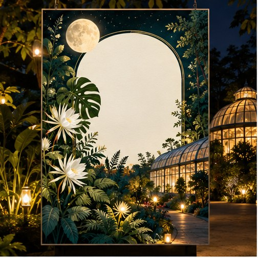</p>

67 lệnh tạo mới có ảnh kết quả riêng. 19 lệnh chỉnh sửa có cặp Before và After riêng.

## Cách đọc tài liệu

Mỗi mục bắt đầu bằng từ khóa, sau đó là chức năng, hình minh họa và một câu lệnh mẫu. Các lệnh tạo mới chỉ có ảnh kết quả vì không cần ảnh đầu vào. Các lệnh chỉnh sửa hiển thị Before và After để làm rõ phần thay đổi.

Các từ khóa là shortcut ngữ nghĩa để mô tả nhanh loại công việc. `/poster` và `/logo` là các loại template được OpenAI công khai nhắc tới; các tên khác không phải lệnh hệ thống cố định được bảo đảm trên mọi phiên bản. Khi dùng thực tế, hãy viết thêm chủ thể, bối cảnh, phong cách, tỷ lệ và các phần phải giữ nguyên.

## Nội dung

| Nhóm | Số lệnh | Loại demo |
|---|---:|---|
| [Thiết kế đồ họa](#thiết-kế-đồ-họa) | 20 | Ảnh kết quả |
| [Ảnh thương mại](#ảnh-thương-mại) | 12 | Ảnh kết quả |
| [Nhân vật](#nhân-vật) | 11 | Ảnh kết quả |
| [Minh họa và nghệ thuật](#minh-họa-và-nghệ-thuật) | 14 | Ảnh kết quả |
| [Sơ đồ và ý tưởng](#sơ-đồ-và-ý-tưởng) | 10 | Ảnh kết quả |
| [Chỉnh sửa ảnh](#chỉnh-sửa-ảnh) | 19 | Before và After |

---

## Thiết kế đồ họa

`/poster` · `/logo` · `/banner` · `/flyer` · `/brochure` · `/book-cover` · `/album-cover` · `/magazine-cover` · `/social-post` · `/thumbnail` · `/infographic` · `/menu` · `/invitation` · `/business-card` · `/certificate` · `/packaging` · `/label` · `/sticker` · `/icon` · `/wallpaper`

### `/poster`

Tạo poster cho sự kiện, chiến dịch hoặc nội dung trưng bày.

<br><sub>Kết quả mẫu</sub>

**Ví dụ lệnh**

```text
/poster — đêm nhạc jazz, khổ 2:3, chừa vùng tiêu đề
```

### `/logo`

Khám phá biểu tượng và hướng nhận diện thương hiệu.

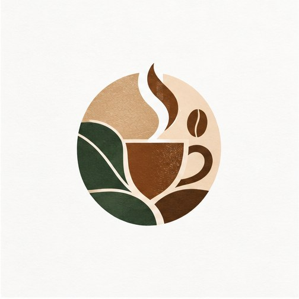<br><sub>Kết quả mẫu</sub>

**Ví dụ lệnh**

```text
/logo — thương hiệu cà phê Mộc, hình học, một màu
```

### `/banner`

Tạo ảnh ngang cho website, quảng cáo hoặc kênh mạng xã hội.

<br><sub>Kết quả mẫu</sub>

**Ví dụ lệnh**

```text
/banner — ra mắt ứng dụng học tập, 16:9
```

### `/flyer`

Thiết kế tờ giới thiệu ngắn cho sự kiện hoặc ưu đãi.

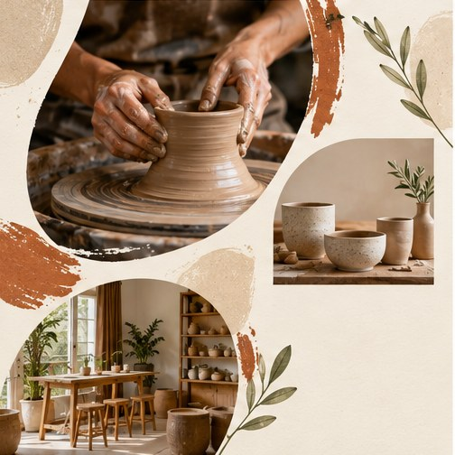<br><sub>Kết quả mẫu</sub>

**Ví dụ lệnh**

```text
/flyer — workshop gốm cuối tuần, A5 dọc
```

### `/brochure`

Tạo ý tưởng bìa hoặc trang gấp giới thiệu sản phẩm dịch vụ.

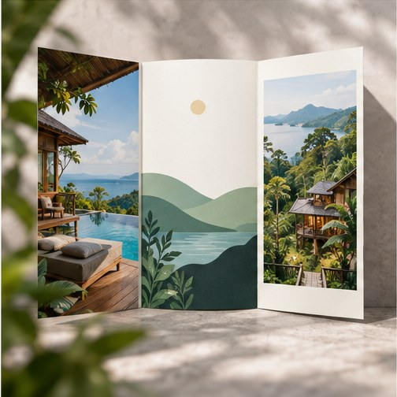<br><sub>Kết quả mẫu</sub>

**Ví dụ lệnh**

```text
/brochure — khu nghỉ dưỡng sinh thái, gấp ba
```

### `/book-cover`

Thiết kế bìa sách theo thể loại và đối tượng đọc.

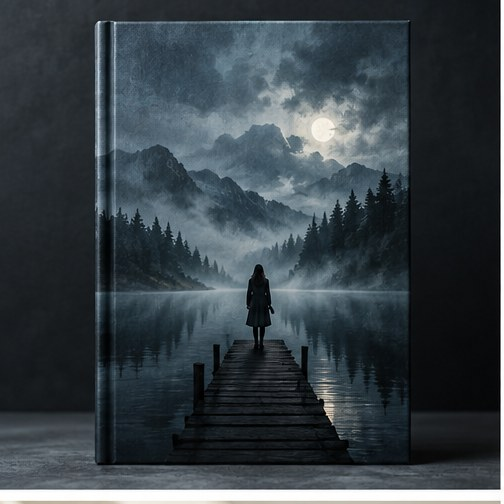<br><sub>Kết quả mẫu</sub>

**Ví dụ lệnh**

```text
/book-cover — tiểu thuyết trinh thám, tối giản
```

### `/album-cover`

Tạo bìa album hoặc single có hình ảnh chủ đạo mạnh.

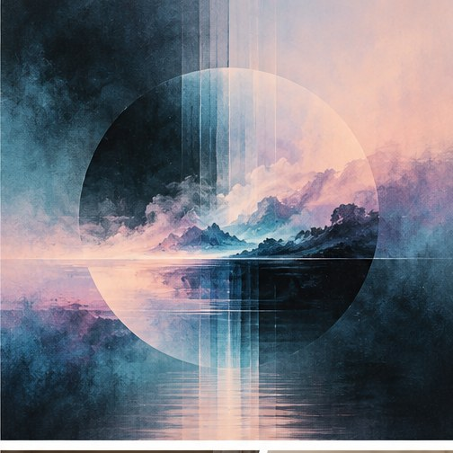<br><sub>Kết quả mẫu</sub>

**Ví dụ lệnh**

```text
/album-cover — ambient điện tử, trừu tượng
```

### `/magazine-cover`

Tạo bố cục bìa tạp chí với vùng ảnh và tiêu đề rõ.

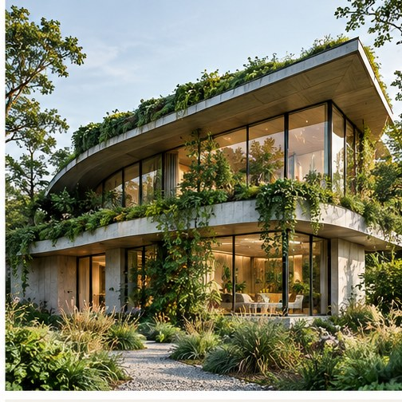<br><sub>Kết quả mẫu</sub>

**Ví dụ lệnh**

```text
/magazine-cover — kiến trúc bền vững, editorial
```

### `/social-post`

Tạo nội dung hình cho bài đăng mạng xã hội.

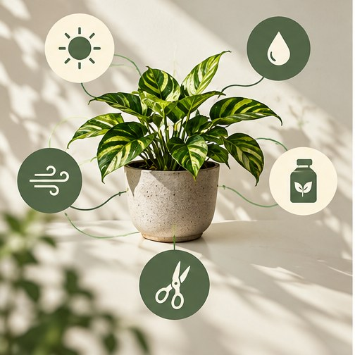<br><sub>Kết quả mẫu</sub>

**Ví dụ lệnh**

```text
/social-post — mẹo chăm cây, vuông 1:1
```

### `/thumbnail`

Tạo thumbnail dễ nhận biết ở kích thước nhỏ.

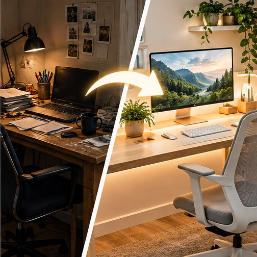<br><sub>Kết quả mẫu</sub>

**Ví dụ lệnh**

```text
/thumbnail — video sửa bàn làm việc, 16:9
```

### `/infographic`

Biến thông tin thành bố cục trực quan có thứ bậc.

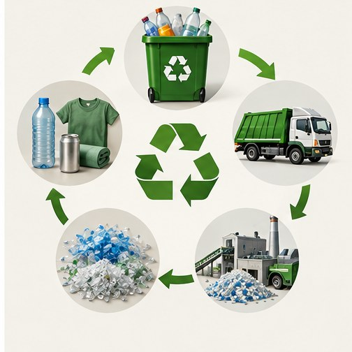<br><sub>Kết quả mẫu</sub>

**Ví dụ lệnh**

```text
/infographic — quy trình tái chế 5 bước
```

### `/menu`

Tạo bố cục menu món ăn hoặc bảng giá.

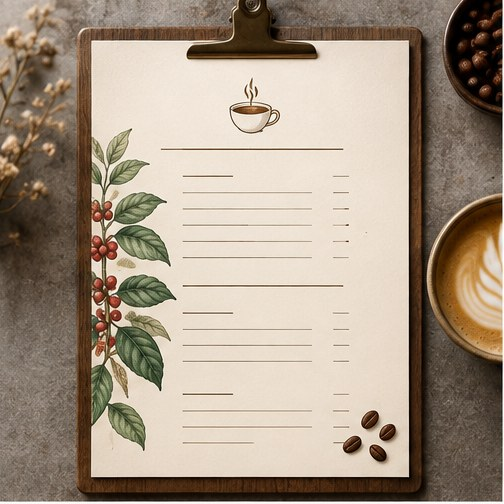<br><sub>Kết quả mẫu</sub>

**Ví dụ lệnh**

```text
/menu — quán cà phê tối giản, A4
```

### `/invitation`

Thiết kế thiệp mời theo dịp và phong cách.

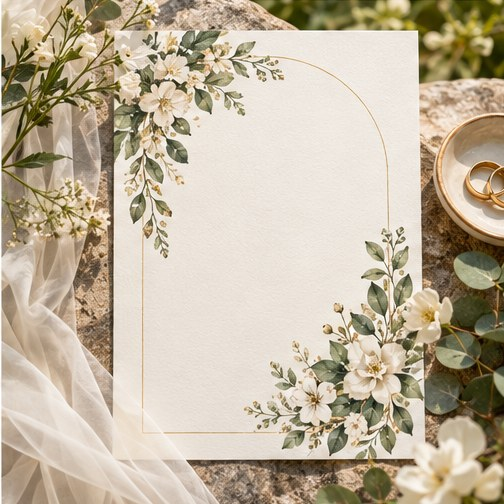<br><sub>Kết quả mẫu</sub>

**Ví dụ lệnh**

```text
/invitation — tiệc cưới ngoài trời, watercolor
```

### `/business-card`

Khám phá bố cục danh thiếp hai mặt.

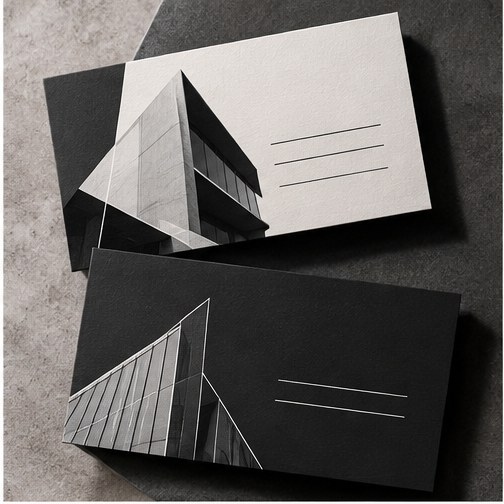<br><sub>Kết quả mẫu</sub>

**Ví dụ lệnh**

```text
/business-card — studio kiến trúc, đen trắng
```

### `/certificate`

Tạo khung và bố cục chứng nhận trang trọng.

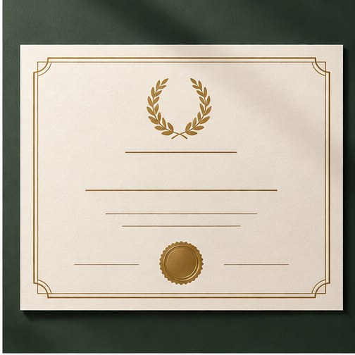<br><sub>Kết quả mẫu</sub>

**Ví dụ lệnh**

```text
/certificate — chứng nhận hoàn thành khóa học
```

### `/packaging`

Tạo concept bao bì hoặc hộp sản phẩm.

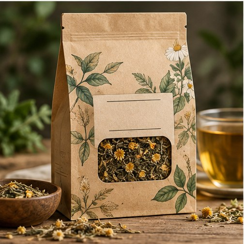<br><sub>Kết quả mẫu</sub>

**Ví dụ lệnh**

```text
/packaging — hộp trà thảo mộc, giấy tái chế
```

### `/label`

Thiết kế nhãn cho chai lọ, hộp hoặc sản phẩm thủ công.

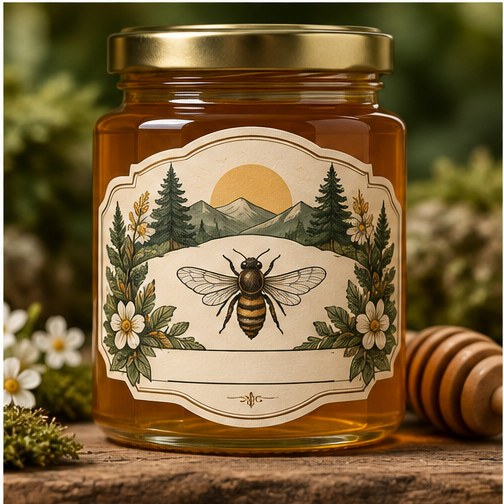<br><sub>Kết quả mẫu</sub>

**Ví dụ lệnh**

```text
/label — mật ong rừng, vintage
```

### `/sticker`

Tạo sticker riêng lẻ, thường dùng viền rõ hoặc nền trong suốt.

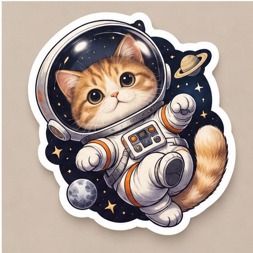<br><sub>Kết quả mẫu</sub>

**Ví dụ lệnh**

```text
/sticker — mèo phi hành gia, viền trắng
```

### `/icon`

Tạo biểu tượng đơn giản cho ứng dụng hoặc danh mục.

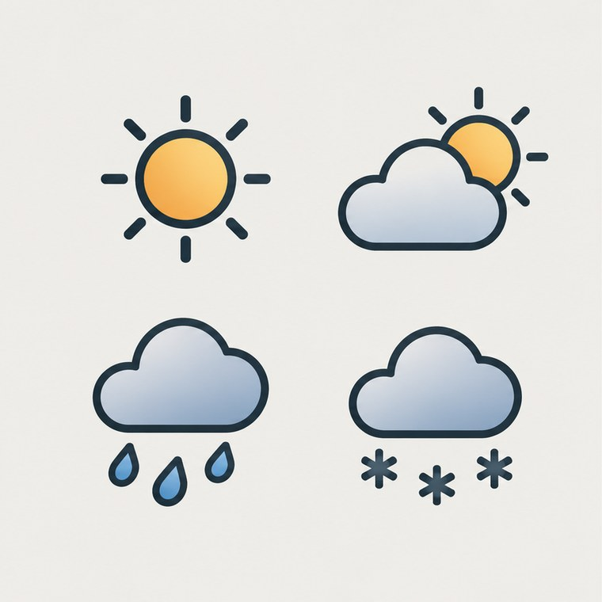<br><sub>Kết quả mẫu</sub>

**Ví dụ lệnh**

```text
/icon — bộ biểu tượng thời tiết, nét đều
```

### `/wallpaper`

Tạo hình nền cho điện thoại hoặc máy tính.

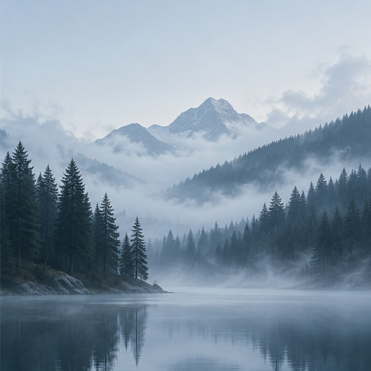<br><sub>Kết quả mẫu</sub>

**Ví dụ lệnh**

```text
/wallpaper — rừng sương tối giản, 9:16
```

---

## Ảnh thương mại

`/product-photo` · `/product-mockup` · `/advertisement` · `/campaign` · `/fashion` · `/editorial` · `/food-photo` · `/real-estate` · `/interior` · `/architecture` · `/catalog` · `/lookbook`

### `/product-photo`

Tạo ảnh sản phẩm theo phong cách chụp studio hoặc lifestyle.

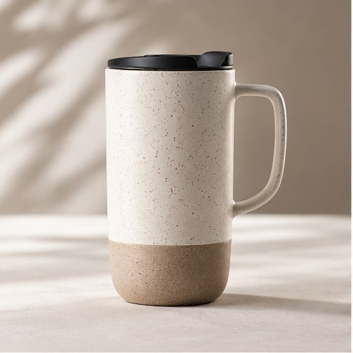<br><sub>Kết quả mẫu</sub>

**Ví dụ lệnh**

```text
/product-photo — chai nước hoa trên đá đen
```

### `/product-mockup`

Đặt thiết kế hoặc sản phẩm vào bối cảnh sử dụng giả lập.

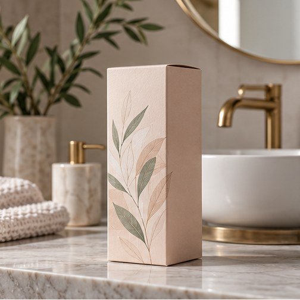<br><sub>Kết quả mẫu</sub>

**Ví dụ lệnh**

```text
/product-mockup — hộp mỹ phẩm trên kệ phòng tắm
```

### `/advertisement`

Tạo key visual quảng cáo hướng đến một lợi ích cụ thể.

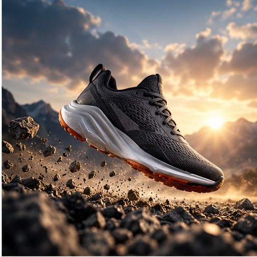<br><sub>Kết quả mẫu</sub>

**Ví dụ lệnh**

```text
/advertisement — giày chạy bộ siêu nhẹ, ảnh dọc
```

### `/campaign`

Khám phá hình ảnh chủ đạo cho một chiến dịch nhiều định dạng.

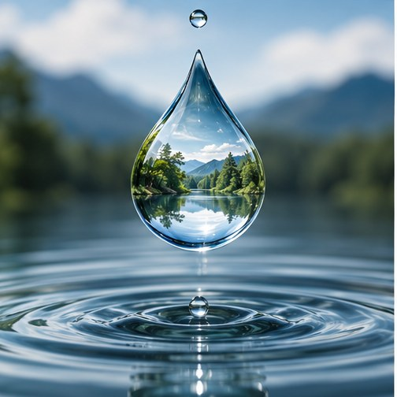<br><sub>Kết quả mẫu</sub>

**Ví dụ lệnh**

```text
/campaign — tiết kiệm nước, tông xanh lam
```

### `/fashion`

Tạo ảnh thời trang tập trung vào trang phục, tạo dáng và ánh sáng.

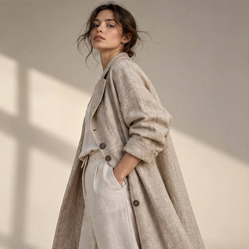<br><sub>Kết quả mẫu</sub>

**Ví dụ lệnh**

```text
/fashion — áo khoác linen, studio tối giản
```

### `/editorial`

Tạo ảnh kể chuyện theo phong cách tạp chí.

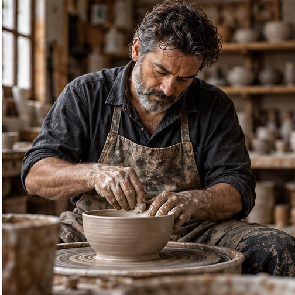<br><sub>Kết quả mẫu</sub>

**Ví dụ lệnh**

```text
/editorial — nghệ nhân gốm trong xưởng
```

### `/food-photo`

Tạo ảnh món ăn với ánh sáng và styling phù hợp.

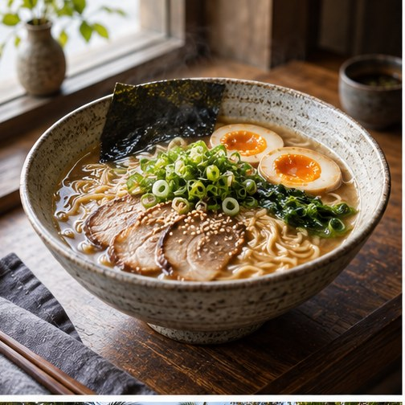<br><sub>Kết quả mẫu</sub>

**Ví dụ lệnh**

```text
/food-photo — tô ramen, ánh sáng cửa sổ
```

### `/real-estate`

Tạo hoặc nâng cấp ảnh giới thiệu bất động sản.

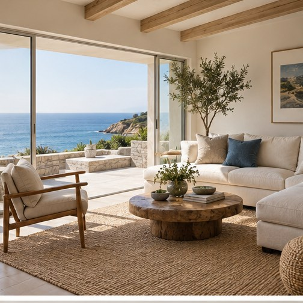<br><sub>Kết quả mẫu</sub>

**Ví dụ lệnh**

```text
/real-estate — phòng khách nhìn ra biển, góc rộng
```

### `/interior`

Khám phá thiết kế và không khí của không gian nội thất.

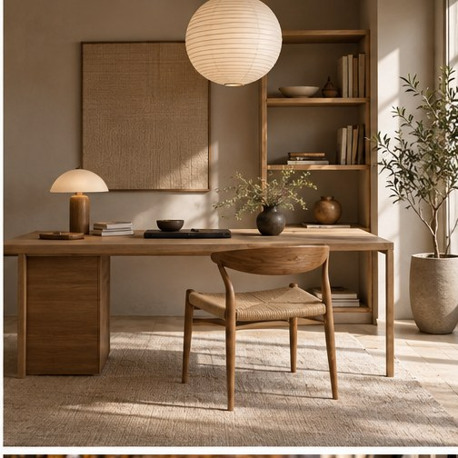<br><sub>Kết quả mẫu</sub>

**Ví dụ lệnh**

```text
/interior — phòng làm việc Japandi
```

### `/architecture`

Tạo hình công trình với phối cảnh và vật liệu rõ.

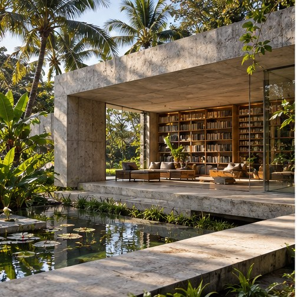<br><sub>Kết quả mẫu</sub>

**Ví dụ lệnh**

```text
/architecture — thư viện bê tông nhiệt đới
```

### `/catalog`

Tạo ảnh sản phẩm đồng nhất cho danh mục.

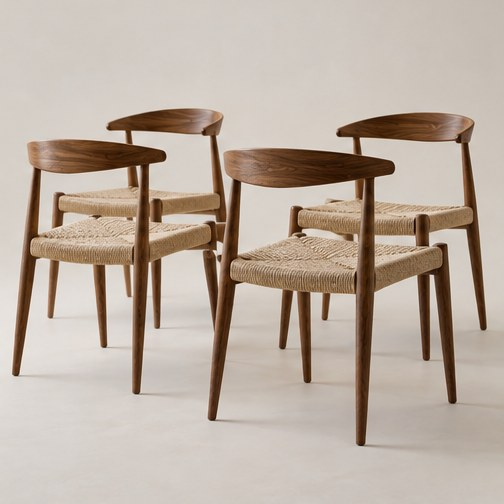<br><sub>Kết quả mẫu</sub>

**Ví dụ lệnh**

```text
/catalog — bộ ghế ăn, nền xám sáng
```

### `/lookbook`

Tạo chuỗi hình thể hiện bộ sưu tập và cách phối.

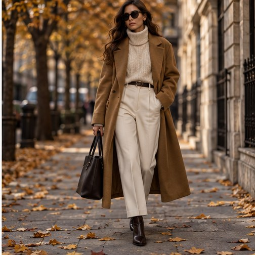<br><sub>Kết quả mẫu</sub>

**Ví dụ lệnh**

```text
/lookbook — thời trang mùa thu, đường phố
```

---

## Nhân vật

`/portrait` · `/headshot` · `/avatar` · `/profile-picture` · `/character` · `/character-sheet` · `/mascot` · `/anime` · `/cartoon` · `/comic` · `/figurine`

### `/portrait`

Tạo chân dung có kiểm soát góc máy, ánh sáng và biểu cảm.

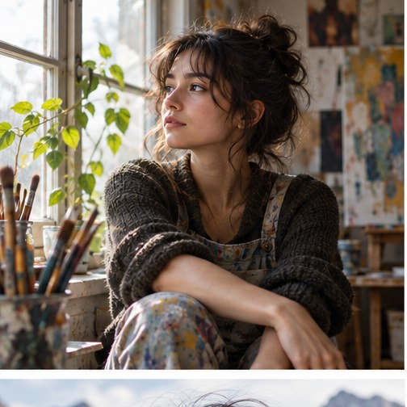<br><sub>Kết quả mẫu</sub>

**Ví dụ lệnh**

```text
/portrait — nghệ sĩ trẻ, ánh sáng cửa sổ, 4:5
```

### `/headshot`

Tạo ảnh cận mặt chuyên nghiệp cho hồ sơ.

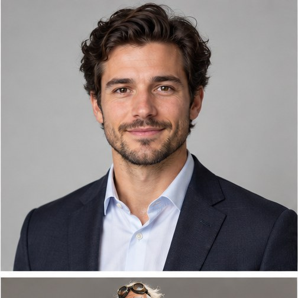<br><sub>Kết quả mẫu</sub>

**Ví dụ lệnh**

```text
/headshot — nền xám, ánh sáng mềm, nhìn camera
```

### `/avatar`

Tạo hình đại diện nhận biết tốt ở kích thước nhỏ.

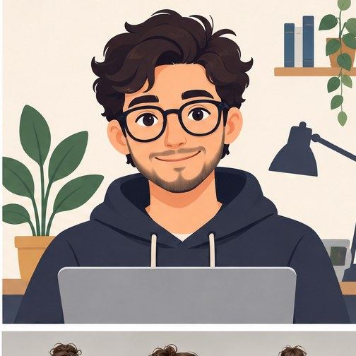<br><sub>Kết quả mẫu</sub>

**Ví dụ lệnh**

```text
/avatar — nhà phát triển game, minh họa phẳng
```

### `/profile-picture`

Tạo ảnh hồ sơ phù hợp nền tảng và tỷ lệ tròn hoặc vuông.

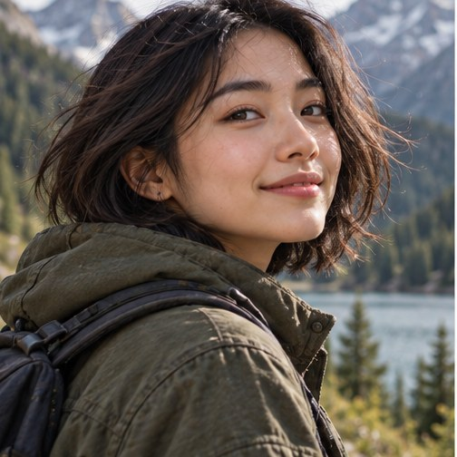<br><sub>Kết quả mẫu</sub>

**Ví dụ lệnh**

```text
/profile-picture — chân dung thân thiện, 1:1
```

### `/character`

Thiết kế một nhân vật từ ngoại hình, vai trò và tính cách.

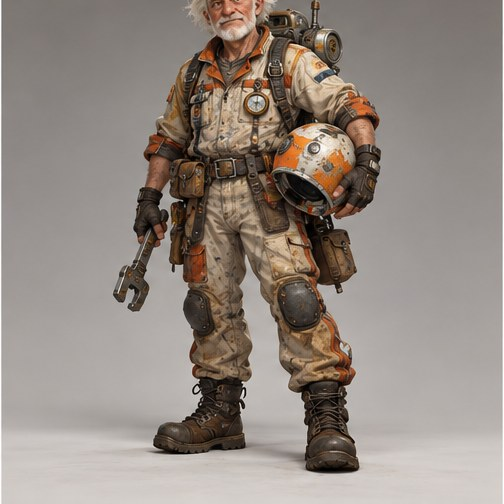<br><sub>Kết quả mẫu</sub>

**Ví dụ lệnh**

```text
/character — thợ máy không gian lớn tuổi
```

### `/character-sheet`

Trình bày nhân vật ở nhiều góc, tư thế hoặc biểu cảm.

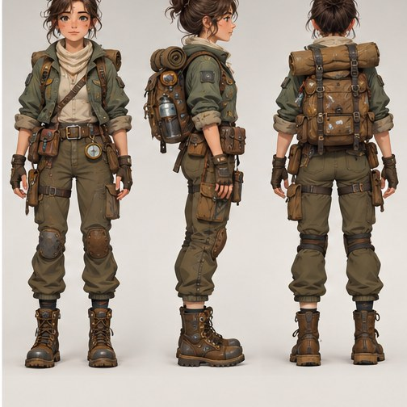<br><sub>Kết quả mẫu</sub>

**Ví dụ lệnh**

```text
/character-sheet — chính diện, nghiêng, sau lưng
```

### `/mascot`

Tạo linh vật dễ nhận diện cho thương hiệu hoặc cộng đồng.

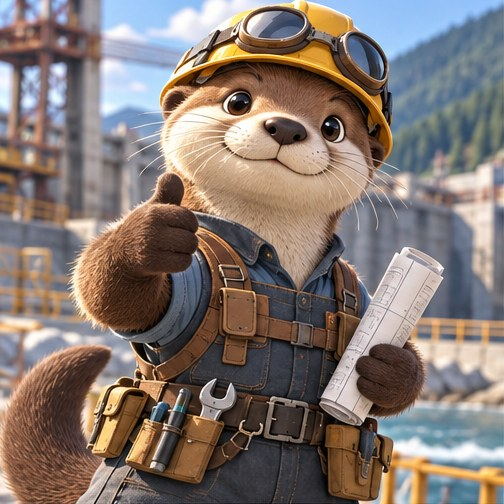<br><sub>Kết quả mẫu</sub>

**Ví dụ lệnh**

```text
/mascot — rái cá kỹ sư, thân thiện
```

### `/anime`

Tạo nhân vật hoặc cảnh theo ngôn ngữ anime chung.

<br><sub>Kết quả mẫu</sub>

**Ví dụ lệnh**

```text
/anime — nữ phi công trong buồng lái
```

### `/cartoon`

Chuyển ý tưởng thành tạo hình hoạt hình đơn giản.

<br><sub>Kết quả mẫu</sub>

**Ví dụ lệnh**

```text
/cartoon — đầu bếp gấu trúc, màu phẳng
```

### `/comic`

Tạo phong cách truyện tranh hoặc trang truyện.

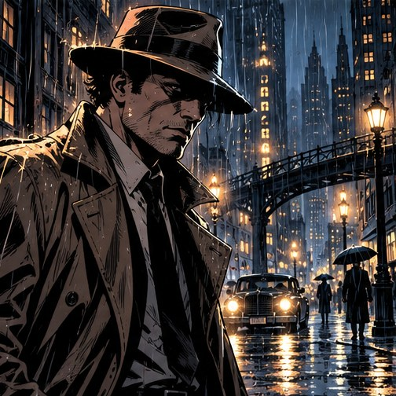<br><sub>Kết quả mẫu</sub>

**Ví dụ lệnh**

```text
/comic — thám tử trong thành phố mưa
```

### `/figurine`

Tạo mockup mô hình nhân vật sưu tầm.

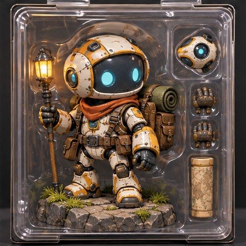<br><sub>Kết quả mẫu</sub>

**Ví dụ lệnh**

```text
/figurine — robot thám hiểm, hộp trưng bày
```

---

## Minh họa và nghệ thuật

`/illustration` · `/concept-art` · `/storyboard` · `/comic-panel` · `/children-book` · `/watercolor` · `/oil-painting` · `/sketch` · `/line-art` · `/pixel-art` · `/3d-render` · `/isometric` · `/collage` · `/pattern`

### `/illustration`

Tạo minh họa tổng quát theo chất liệu hoặc mục đích.

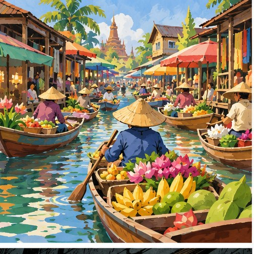<br><sub>Kết quả mẫu</sub>

**Ví dụ lệnh**

```text
/illustration — khu chợ nổi, gouache
```

### `/concept-art`

Khám phá bối cảnh, sinh vật, đạo cụ hoặc thế giới hư cấu.

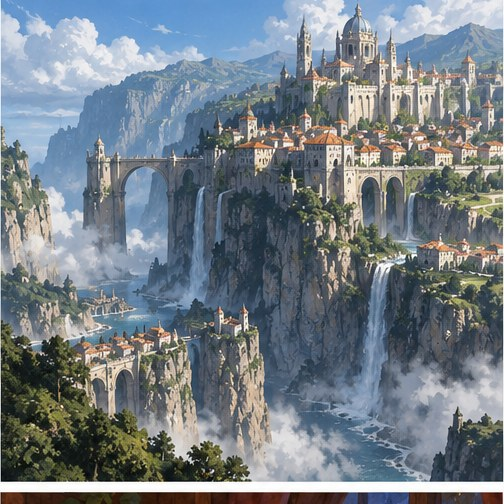<br><sub>Kết quả mẫu</sub>

**Ví dụ lệnh**

```text
/concept-art — thành phố trên vách đá
```

### `/storyboard`

Tạo chuỗi khung hình mô tả hành động và góc máy.

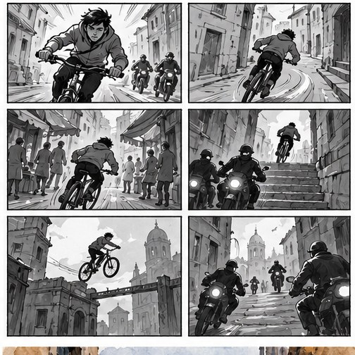<br><sub>Kết quả mẫu</sub>

**Ví dụ lệnh**

```text
/storyboard — cảnh rượt đuổi 6 khung
```

### `/comic-panel`

Tạo một khung truyện tranh với hành động rõ.

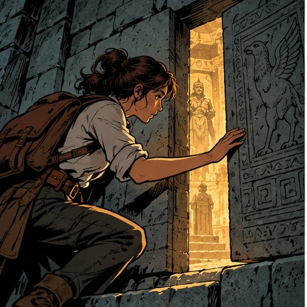<br><sub>Kết quả mẫu</sub>

**Ví dụ lệnh**

```text
/comic-panel — nhân vật mở cánh cửa bí mật
```

### `/children-book`

Tạo minh họa truyện thiếu nhi ấm áp, dễ đọc.

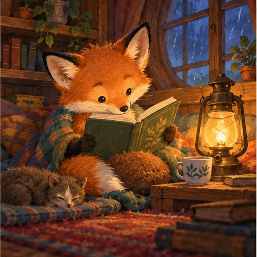<br><sub>Kết quả mẫu</sub>

**Ví dụ lệnh**

```text
/children-book — cáo con đọc sách dưới đèn
```

### `/watercolor`

Tạo bề mặt loang màu và mép cọ kiểu màu nước.

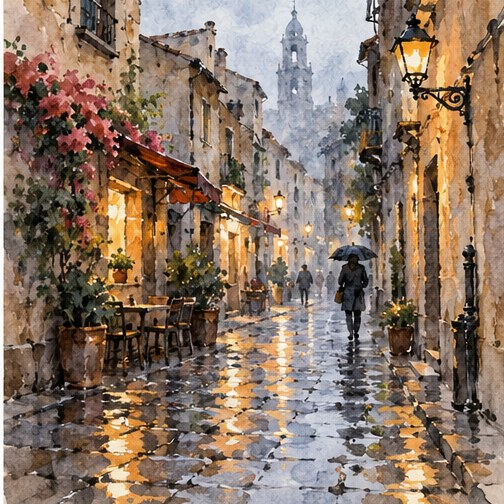<br><sub>Kết quả mẫu</sub>

**Ví dụ lệnh**

```text
/watercolor — phố cổ sau mưa
```

### `/oil-painting`

Mô phỏng lớp sơn dày, ánh sáng và chiều sâu hội họa.

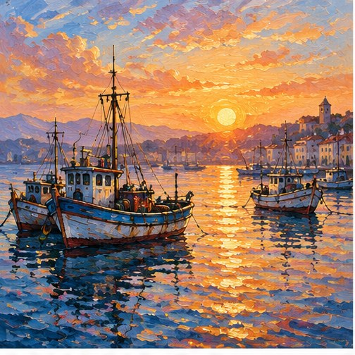<br><sub>Kết quả mẫu</sub>

**Ví dụ lệnh**

```text
/oil-painting — thuyền đánh cá lúc bình minh
```

### `/sketch`

Tạo phác thảo nhanh bằng chì hoặc mực.

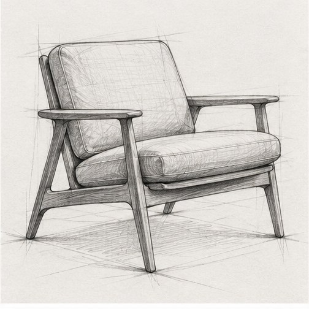<br><sub>Kết quả mẫu</sub>

**Ví dụ lệnh**

```text
/sketch — ghế lounge, góc ba phần tư
```

### `/line-art`

Tạo hình bằng nét viền sạch, ít hoặc không tô màu.

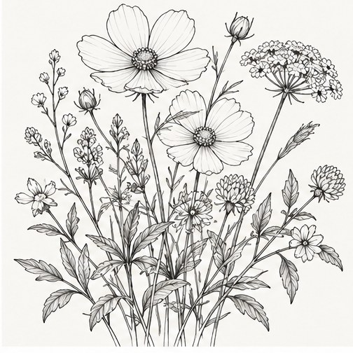<br><sub>Kết quả mẫu</sub>

**Ví dụ lệnh**

```text
/line-art — bó hoa dại, nét mảnh
```

### `/pixel-art`

Tạo đồ họa điểm ảnh theo kích thước và bảng màu giới hạn.

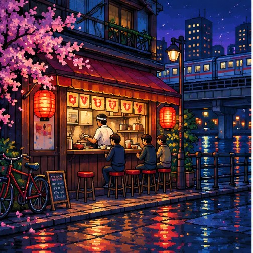<br><sub>Kết quả mẫu</sub>

**Ví dụ lệnh**

```text
/pixel-art — quán mì ban đêm, 32-bit
```

### `/3d-render`

Tạo hình kết xuất 3D với vật liệu và ánh sáng rõ.

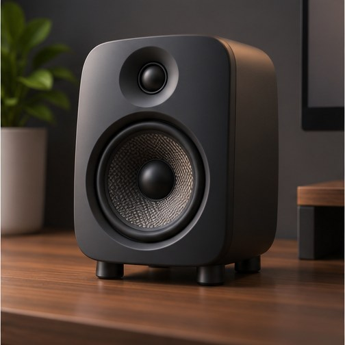<br><sub>Kết quả mẫu</sub>

**Ví dụ lệnh**

```text
/3d-render — loa để bàn bằng nhựa mờ
```

### `/isometric`

Tạo góc nhìn đẳng cự phù hợp bản đồ hoặc mô hình.

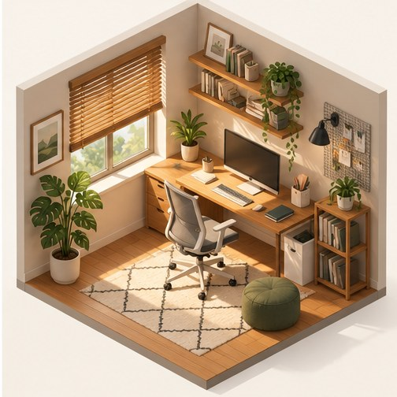<br><sub>Kết quả mẫu</sub>

**Ví dụ lệnh**

```text
/isometric — phòng làm việc nhỏ
```

### `/collage`

Kết hợp ảnh, giấy và texture theo bố cục cắt dán.

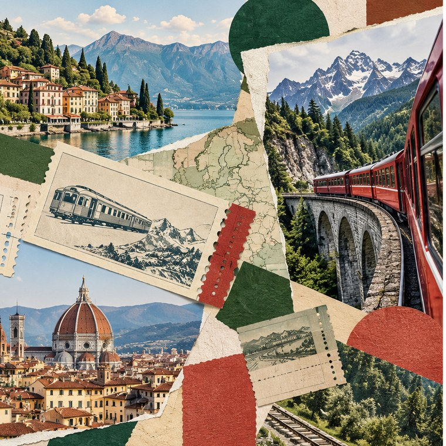<br><sub>Kết quả mẫu</sub>

**Ví dụ lệnh**

```text
/collage — du lịch đường sắt châu Âu
```

### `/pattern`

Tạo họa tiết lặp cho vải, giấy hoặc nền.

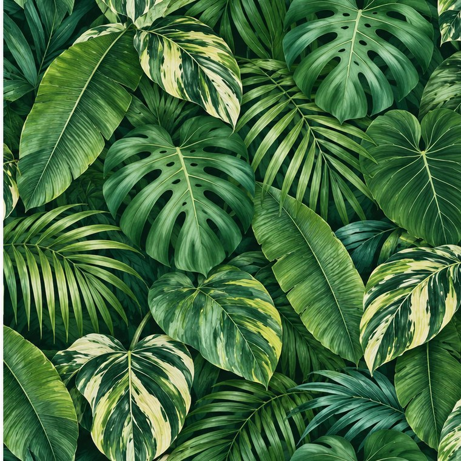<br><sub>Kết quả mẫu</sub>

**Ví dụ lệnh**

```text
/pattern — lá nhiệt đới, seamless
```

---

## Sơ đồ và ý tưởng

`/diagram` · `/flowchart` · `/map` · `/mind-map` · `/timeline` · `/blueprint` · `/cutaway` · `/exploded-view` · `/technical-drawing` · `/floor-plan`

### `/diagram`

Tạo sơ đồ giải thích cấu trúc hoặc quan hệ giữa các phần.

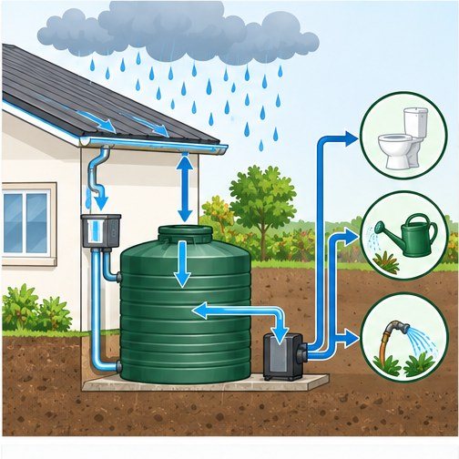<br><sub>Kết quả mẫu</sub>

**Ví dụ lệnh**

```text
/diagram — hệ thống thu nước mưa gia đình
```

### `/flowchart`

Tạo luồng quyết định hoặc quy trình theo bước.

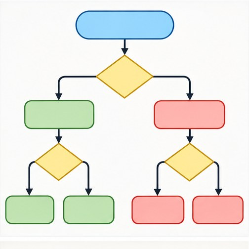<br><sub>Kết quả mẫu</sub>

**Ví dụ lệnh**

```text
/flowchart — xử lý yêu cầu hỗ trợ khách hàng
```

### `/map`

Tạo bản đồ minh họa địa điểm, tuyến đường hoặc thế giới hư cấu.

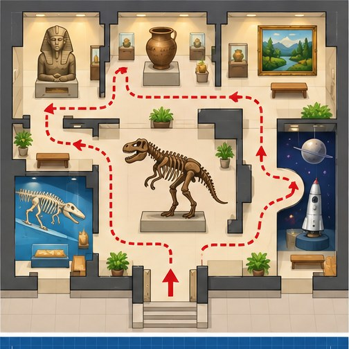<br><sub>Kết quả mẫu</sub>

**Ví dụ lệnh**

```text
/map — tuyến tham quan bảo tàng
```

### `/mind-map`

Tổ chức một chủ đề thành các nhánh ý tưởng.

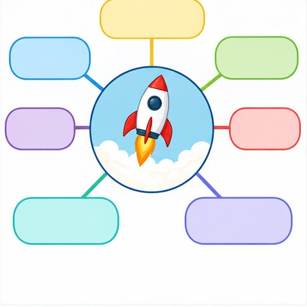<br><sub>Kết quả mẫu</sub>

**Ví dụ lệnh**

```text
/mind-map — kế hoạch ra mắt sản phẩm
```

### `/timeline`

Trình bày sự kiện hoặc giai đoạn theo thời gian.

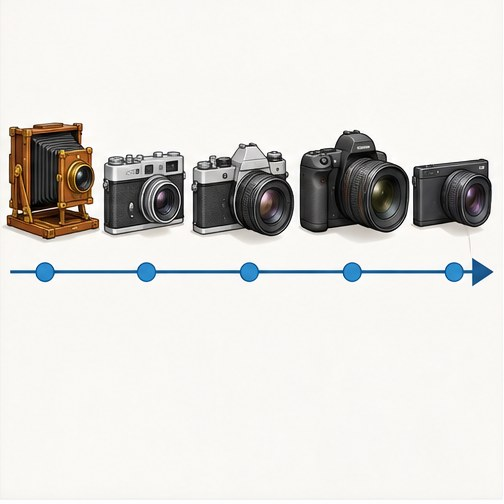<br><sub>Kết quả mẫu</sub>

**Ví dụ lệnh**

```text
/timeline — lịch sử máy ảnh 1900 đến nay
```

### `/blueprint`

Tạo bản vẽ ý tưởng theo phong cách kỹ thuật.

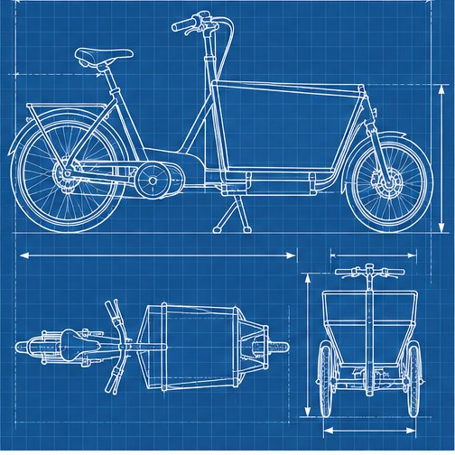<br><sub>Kết quả mẫu</sub>

**Ví dụ lệnh**

```text
/blueprint — xe đạp chở hàng điện
```

### `/cutaway`

Cắt một phần vỏ để nhìn cấu trúc bên trong.

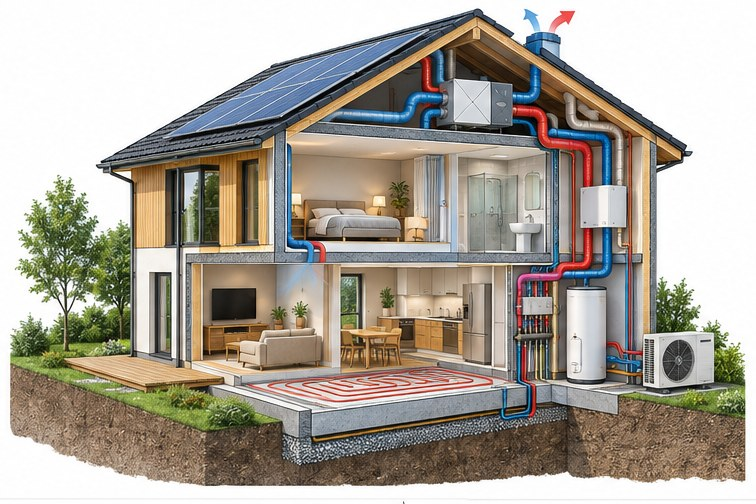<br><sub>Kết quả mẫu</sub>

**Ví dụ lệnh**

```text
/cutaway — nhà tiết kiệm năng lượng
```

### `/exploded-view`

Tách các bộ phận theo trục để giải thích lắp ráp.

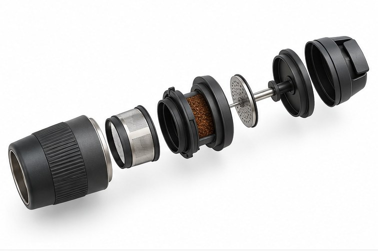<br><sub>Kết quả mẫu</sub>

**Ví dụ lệnh**

```text
/exploded-view — máy pha cà phê cầm tay
```

### `/technical-drawing`

Tạo hình kỹ thuật nhấn vào tỷ lệ và cấu tạo.

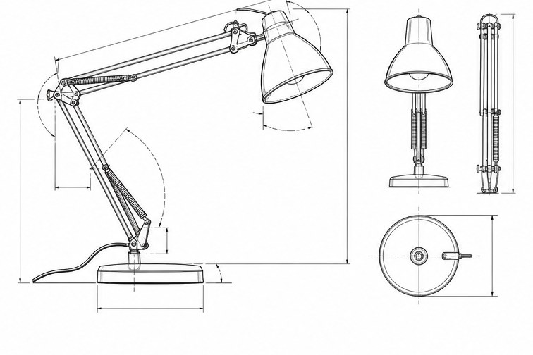<br><sub>Kết quả mẫu</sub>

**Ví dụ lệnh**

```text
/technical-drawing — đèn bàn khớp xoay
```

### `/floor-plan`

Tạo mặt bằng nhìn từ trên xuống cho không gian.

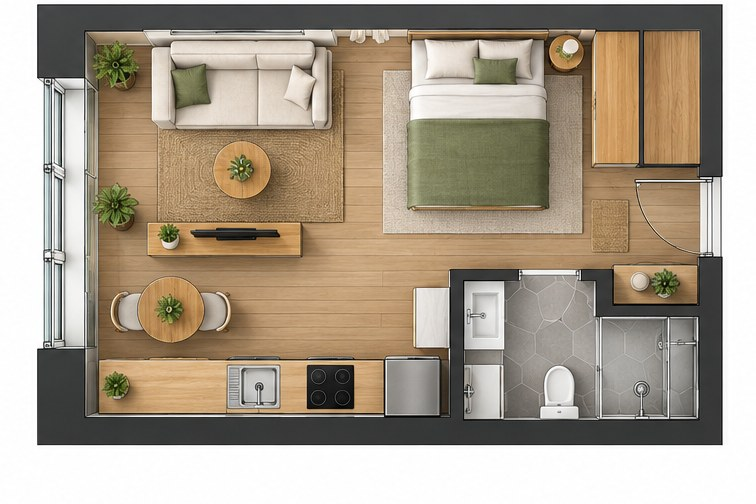<br><sub>Kết quả mẫu</sub>

**Ví dụ lệnh**

```text
/floor-plan — căn hộ studio 35 mét vuông
```

---

## Chỉnh sửa ảnh

`/edit` · `/remove-object` · `/replace-object` · `/replace-background` · `/remove-background` · `/transparent-background` · `/retouch` · `/restore` · `/colorize` · `/recolor` · `/relight` · `/upscale` · `/outpaint` · `/inpaint` · `/crop` · `/resize` · `/reframe` · `/style-transfer` · `/image-variation`

### `/edit`

Chỉnh sửa tổng quát một hoặc nhiều phần của ảnh.

| Before | After |
|:---:|:---:|
| 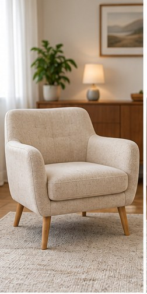 | 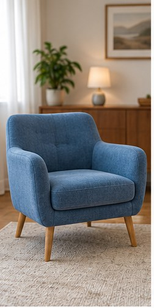 |

**Ví dụ lệnh**

```text
/edit — đổi áo sang màu xanh, giữ nguyên khuôn mặt
```

### `/remove-object`

Xóa vật thể và phục dựng phần nền bị che.

| Before | After |
|:---:|:---:|
| 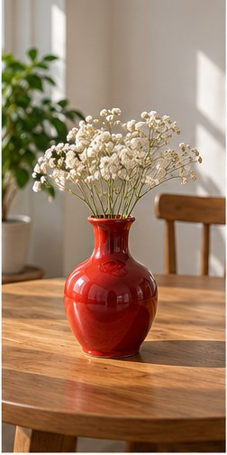 | 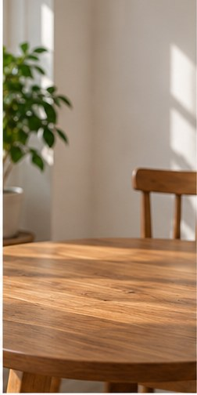 |

**Ví dụ lệnh**

```text
/remove-object — xóa bàn tay, giữ nguyên chuột
```

### `/replace-object`

Thay một vật thể bằng vật thể khác cùng vị trí.

| Before | After |
|:---:|:---:|
| 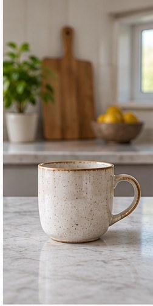 | 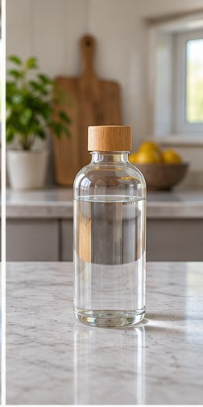 |

**Ví dụ lệnh**

```text
/replace-object — thay cốc bằng bình thủy tinh
```

### `/replace-background`

Đổi bối cảnh nhưng giữ nguyên chủ thể.

| Before | After |
|:---:|:---:|
| 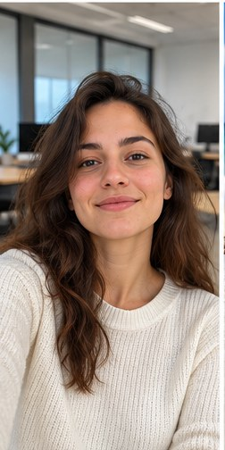 | 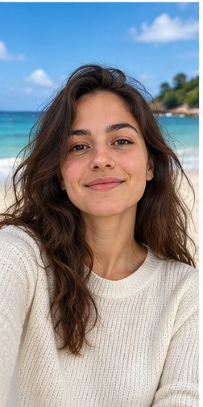 |

**Ví dụ lệnh**

```text
/replace-background — chuyển sang studio màu be
```

### `/remove-background`

Tách chủ thể khỏi nền hiện tại.

| Before | After |
|:---:|:---:|
| 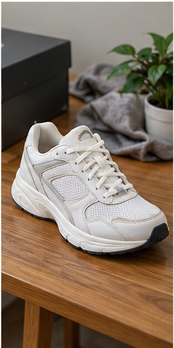 | 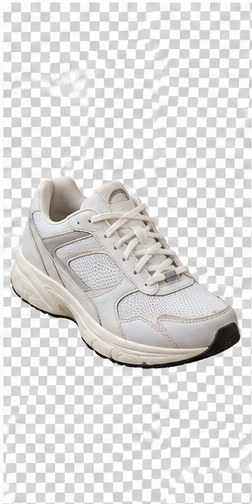 |

**Ví dụ lệnh**

```text
/remove-background — giữ mép tóc sạch
```

### `/transparent-background`

Xuất chủ thể với nền alpha trong suốt.

| Before | After |
|:---:|:---:|
| 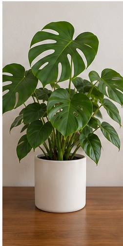 | 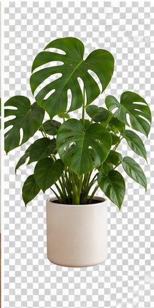 |

**Ví dụ lệnh**

```text
/transparent-background — sản phẩm không viền trắng
```

### `/retouch`

Sửa khuyết điểm nhỏ trong khi giữ texture tự nhiên.

| Before | After |
|:---:|:---:|
| 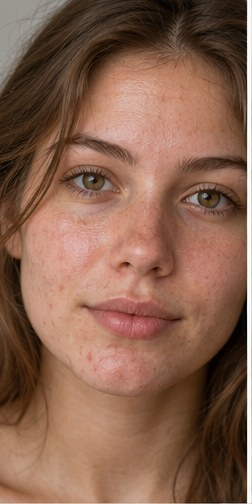 | 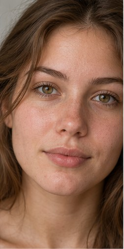 |

**Ví dụ lệnh**

```text
/retouch — giảm bóng dầu, giữ chi tiết da
```

### `/restore`

Phục hồi ảnh cũ, rách, mờ hoặc trầy xước.

| Before | After |
|:---:|:---:|
| 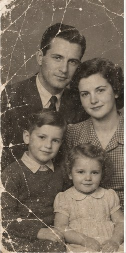 | 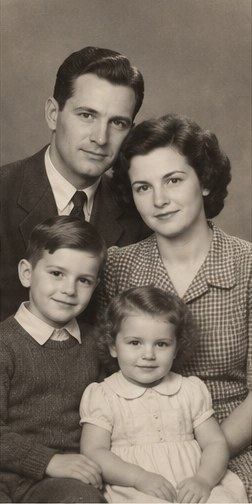 |

**Ví dụ lệnh**

```text
/restore — phục hồi ảnh gia đình cũ
```

### `/colorize`

Thêm màu cho ảnh đen trắng.

| Before | After |
|:---:|:---:|
| 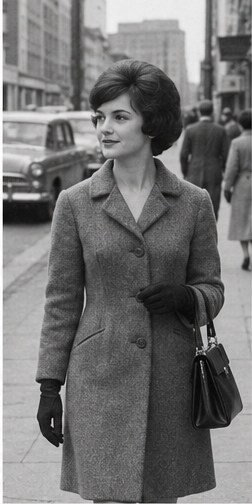 | 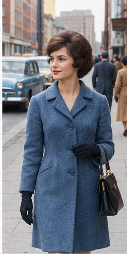 |

**Ví dụ lệnh**

```text
/colorize — màu tự nhiên theo thập niên 1960
```

### `/recolor`

Đổi màu một vật thể hoặc bảng màu của ảnh.

| Before | After |
|:---:|:---:|
| 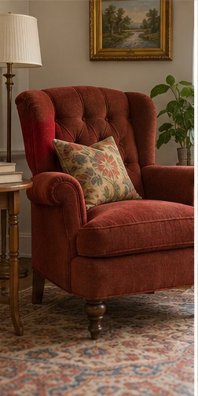 | 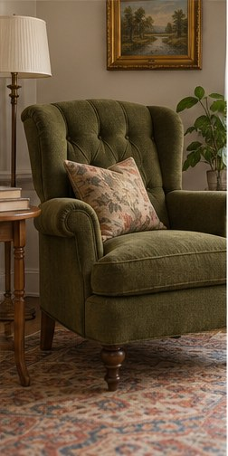 |

**Ví dụ lệnh**

```text
/recolor — đổi ghế đỏ thành xanh olive
```

### `/relight`

Thay đổi hướng, độ mềm hoặc thời điểm ánh sáng.

| Before | After |
|:---:|:---:|
| 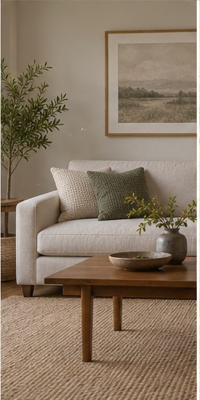 | 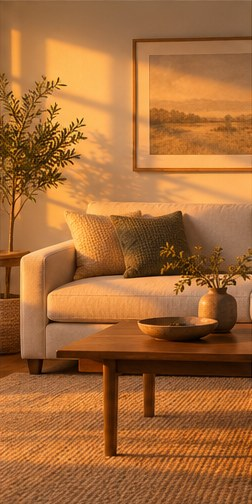 |

**Ví dụ lệnh**

```text
/relight — ánh sáng hoàng hôn từ bên trái
```

### `/upscale`

Tăng độ phân giải và phục hồi chi tiết có kiểm soát.

| Before | After |
|:---:|:---:|
| 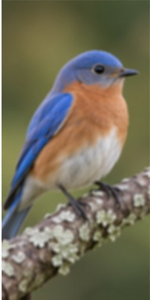 | 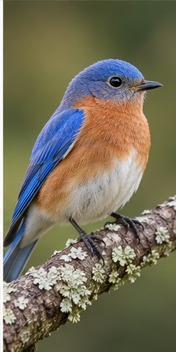 |

**Ví dụ lệnh**

```text
/upscale — tăng nét, không làm da giả
```

### `/outpaint`

Mở rộng khung ảnh ra ngoài biên gốc.

| Before | After |
|:---:|:---:|
| 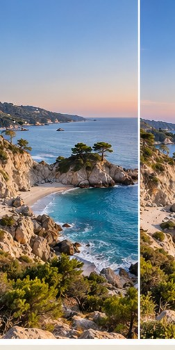 | 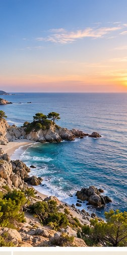 |

**Ví dụ lệnh**

```text
/outpaint — mở sang hai bên thành 16:9
```

### `/inpaint`

Chỉnh một vùng chọn cụ thể trong ảnh.

| Before | After |
|:---:|:---:|
| 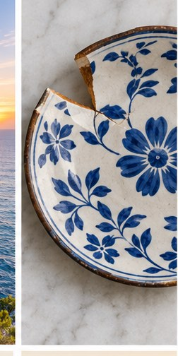 | 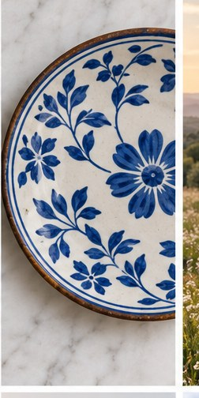 |

**Ví dụ lệnh**

```text
/inpaint — sửa phần tay bị lỗi, giữ mọi phần khác
```

### `/crop`

Cắt ảnh theo khung hoặc chủ thể mong muốn.

| Before | After |
|:---:|:---:|
| 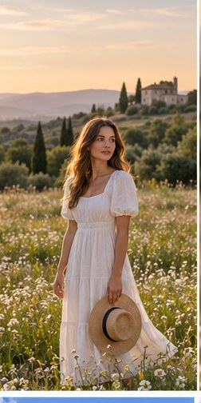 | 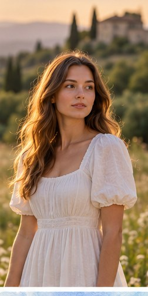 |

**Ví dụ lệnh**

```text
/crop — khổ dọc 4:5, không cắt đầu
```

### `/resize`

Đổi kích thước hoặc tỷ lệ đầu ra.

| Before | After |
|:---:|:---:|
| 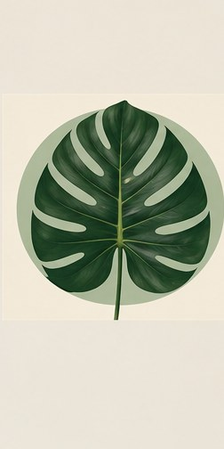 | 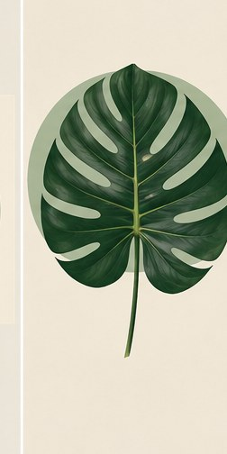 |

**Ví dụ lệnh**

```text
/resize — 1080 x 1350 cho bài đăng
```

### `/reframe`

Sắp lại khung để chủ thể phù hợp tỷ lệ mới.

| Before | After |
|:---:|:---:|
| 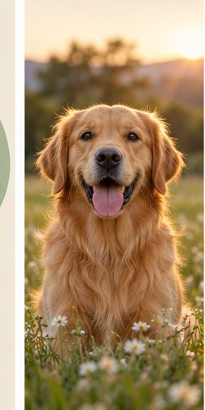 | 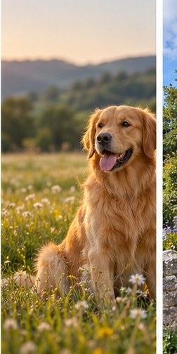 |

**Ví dụ lệnh**

```text
/reframe — đặt chủ thể lệch phải, chừa chữ bên trái
```

### `/style-transfer`

Áp ngôn ngữ thị giác của ảnh tham chiếu lên nội dung.

| Before | After |
|:---:|:---:|
| 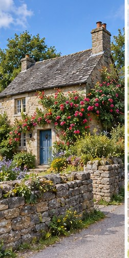 | 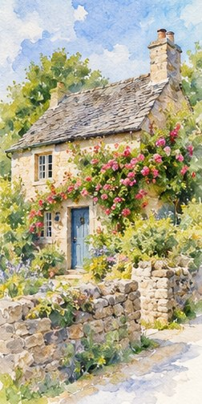 |

**Ví dụ lệnh**

```text
/style-transfer — giữ bố cục, chuyển sang màu nước
```

### `/image-variation`

Tạo biến thể giữ ý tưởng chính nhưng đổi chi tiết.

| Before | After |
|:---:|:---:|
| 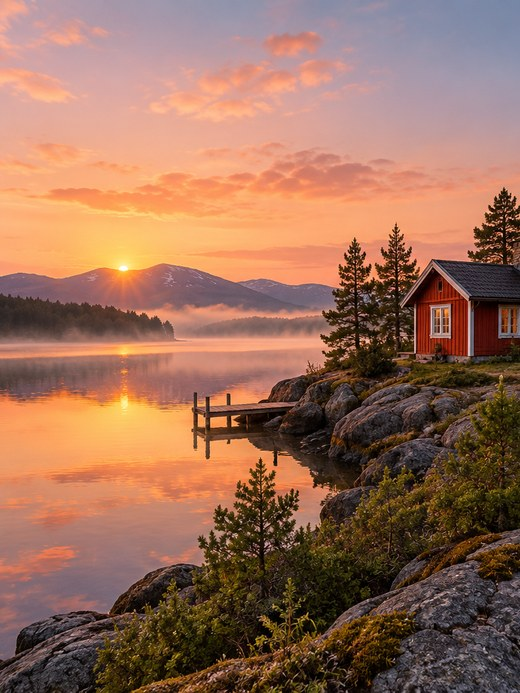 | 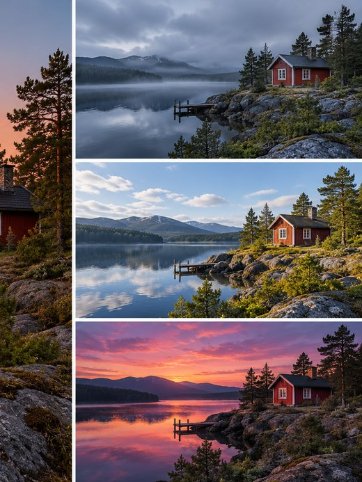 |

**Ví dụ lệnh**

```text
/image-variation — ba phiên bản màu và ánh sáng
```
