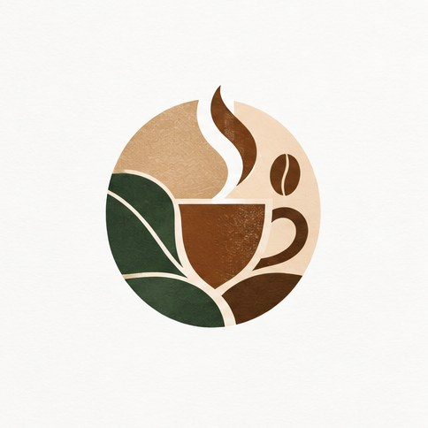

[← Mục lục](../../../README.md) · [Graphic Design (Thiết kế đồ họa)](../README.md)

# `/logo`

Khám phá biểu tượng và hướng nhận diện thương hiệu.



<sub>Kết quả mẫu</sub>

## Ví dụ lệnh

```text
/logo — thương hiệu cà phê Mộc, hình học, một màu
```

---

[← `/poster`](../../../commands/01-graphic-design/poster/README.md) · [`/banner` →](../../../commands/01-graphic-design/banner/README.md)
