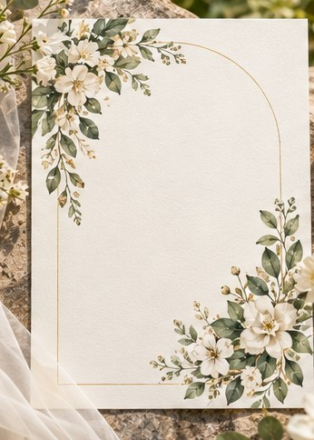

[← Mục lục](../../../README.md) · [Thiết kế đồ họa](../README.md)

# `/invitation`

Thiết kế thiệp mời theo dịp và phong cách.



<sub>Kết quả mẫu</sub>

## Ví dụ lệnh

```text
/invitation — tiệc cưới ngoài trời, watercolor
```

---

[← `/menu`](../../../commands/01-thiet-ke-do-hoa/menu/README.md) · [`/business-card` →](../../../commands/01-thiet-ke-do-hoa/business-card/README.md)
