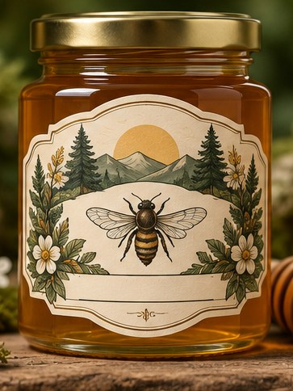

[← Mục lục](../../../README.md) · [Thiết kế đồ họa](../README.md)

# `/label`

Thiết kế nhãn cho chai lọ, hộp hoặc sản phẩm thủ công.



<sub>Kết quả mẫu</sub>

## Ví dụ lệnh

```text
/label — mật ong rừng, vintage
```

---

[← `/packaging`](../../../commands/01-thiet-ke-do-hoa/packaging/README.md) · [`/sticker` →](../../../commands/01-thiet-ke-do-hoa/sticker/README.md)
