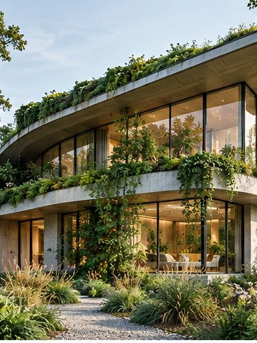

[← Mục lục](../../../README.md) · [Thiết kế đồ họa](../README.md)

# `/magazine-cover`

Tạo bố cục bìa tạp chí với vùng ảnh và tiêu đề rõ.



<sub>Kết quả mẫu</sub>

## Ví dụ lệnh

```text
/magazine-cover — kiến trúc bền vững, editorial
```

---

[← `/album-cover`](../../../commands/01-thiet-ke-do-hoa/album-cover/README.md) · [`/social-post` →](../../../commands/01-thiet-ke-do-hoa/social-post/README.md)
