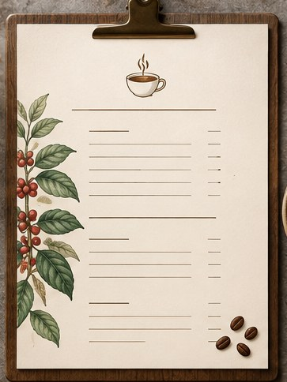

[← Mục lục](../../../README.md) · [Thiết kế đồ họa](../README.md)

# `/menu`

Tạo bố cục menu món ăn hoặc bảng giá.



<sub>Kết quả mẫu</sub>

## Ví dụ lệnh

```text
/menu — quán cà phê tối giản, A4
```

---

[← `/infographic`](../../../commands/01-thiet-ke-do-hoa/infographic/README.md) · [`/invitation` →](../../../commands/01-thiet-ke-do-hoa/invitation/README.md)
