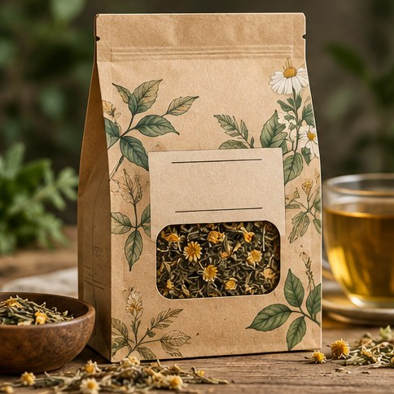

[← Mục lục](../../../README.md) · [Thiết kế đồ họa](../README.md)

# `/packaging`

Tạo concept bao bì hoặc hộp sản phẩm.



<sub>Kết quả mẫu</sub>

## Ví dụ lệnh

```text
/packaging — hộp trà thảo mộc, giấy tái chế
```

---

[← `/certificate`](../../../commands/01-thiet-ke-do-hoa/certificate/README.md) · [`/label` →](../../../commands/01-thiet-ke-do-hoa/label/README.md)
