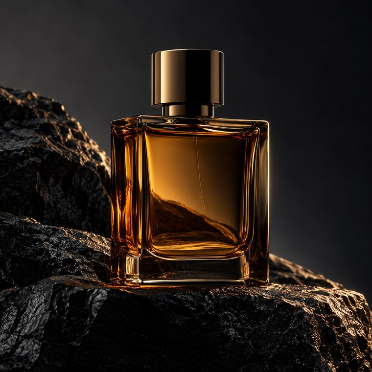

[← Mục lục](../../../README.md) · [Ảnh thương mại](../README.md)

# `/product-photo`

Tạo ảnh sản phẩm theo phong cách chụp studio hoặc lifestyle.



<sub>Kết quả mẫu</sub>

## Ví dụ lệnh

```text
/product-photo — chai nước hoa trên đá đen
```

---

[← `/wallpaper`](../../../commands/01-thiet-ke-do-hoa/wallpaper/README.md) · [`/product-mockup` →](../../../commands/02-anh-thuong-mai/product-mockup/README.md)
