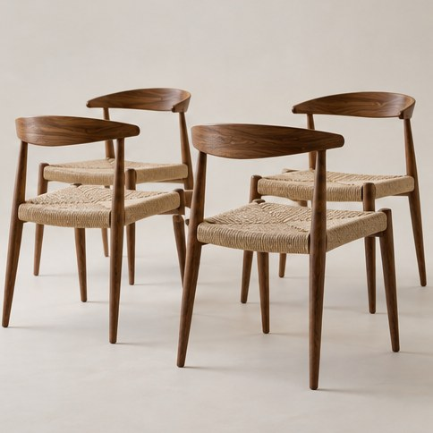

[← Mục lục](../../../README.md) · [Commercial Advertising Photography (Ảnh quảng cáo thương mại)](../README.md)

# `/catalog`

Tạo ảnh sản phẩm đồng nhất cho danh mục.



<sub>Kết quả mẫu</sub>

## Ví dụ lệnh

```text
/catalog — bộ ghế ăn, nền xám sáng
```

---

[← `/architecture`](../../../commands/02-commercial-photography/architecture/README.md) · [`/lookbook` →](../../../commands/02-commercial-photography/lookbook/README.md)
