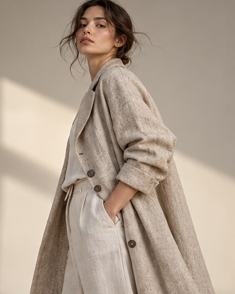

[← Mục lục](../../../README.md) · [Ảnh thương mại](../README.md)

# `/fashion`

Tạo ảnh thời trang tập trung vào trang phục, tạo dáng và ánh sáng.



<sub>Kết quả mẫu</sub>

## Ví dụ lệnh

```text
/fashion — áo khoác linen, studio tối giản
```

---

[← `/campaign`](../../../commands/02-commercial-photography/campaign/README.md) · [`/editorial` →](../../../commands/02-commercial-photography/editorial/README.md)
