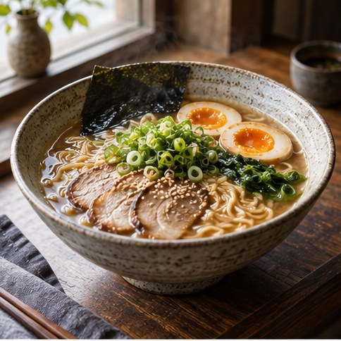

[← Mục lục](../../../README.md) · [Ảnh thương mại](../README.md)

# `/food-photo`

Tạo ảnh món ăn với ánh sáng và styling phù hợp.



<sub>Kết quả mẫu</sub>

## Ví dụ lệnh

```text
/food-photo — tô ramen, ánh sáng cửa sổ
```

---

[← `/editorial`](../../../commands/02-commercial-photography/editorial/README.md) · [`/real-estate` →](../../../commands/02-commercial-photography/real-estate/README.md)
