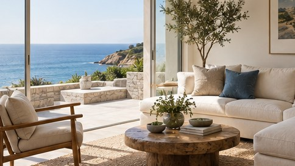

[← Mục lục](../../../README.md) · [Ảnh thương mại](../README.md)

# `/real-estate`

Tạo hoặc nâng cấp ảnh giới thiệu bất động sản.



<sub>Kết quả mẫu</sub>

## Ví dụ lệnh

```text
/real-estate — phòng khách nhìn ra biển, góc rộng
```

---

[← `/food-photo`](../../../commands/02-commercial-photography/food-photo/README.md) · [`/interior` →](../../../commands/02-commercial-photography/interior/README.md)
