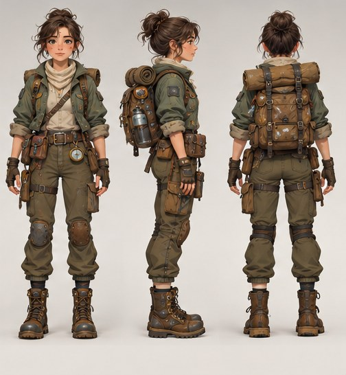

[← Mục lục](../../../README.md) · [Characters (Nhân vật)](../README.md)

# `/character-sheet`

Trình bày nhân vật ở nhiều góc, tư thế hoặc biểu cảm.



<sub>Kết quả mẫu</sub>

## Ví dụ lệnh

```text
/character-sheet — chính diện, nghiêng, sau lưng
```

---

[← `/character`](../../../commands/03-characters/character/README.md) · [`/mascot` →](../../../commands/03-characters/mascot/README.md)
