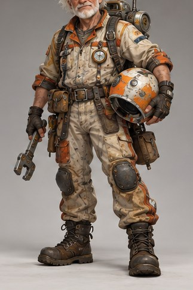

[← Mục lục](../../../README.md) · [Characters (Nhân vật)](../README.md)

# `/character`

Thiết kế một nhân vật từ ngoại hình, vai trò và tính cách.



<sub>Kết quả mẫu</sub>

## Ví dụ lệnh

```text
/character — thợ máy không gian lớn tuổi
```

---

[← `/profile-picture`](../../../commands/03-characters/profile-picture/README.md) · [`/character-sheet` →](../../../commands/03-characters/character-sheet/README.md)
