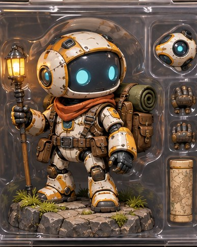

[← Mục lục](../../../README.md) · [Characters (Nhân vật)](../README.md)

# `/figurine`

Tạo mockup mô hình nhân vật sưu tầm.



<sub>Kết quả mẫu</sub>

## Ví dụ lệnh

```text
/figurine — robot thám hiểm, hộp trưng bày
```

---

[← `/comic`](../../../commands/03-characters/comic/README.md) · [`/illustration` →](../../../commands/04-illustration-and-art/illustration/README.md)
