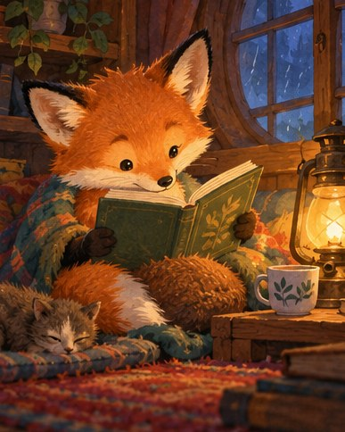

[← Mục lục](../../../README.md) · [Illustration & Art (Minh họa và nghệ thuật)](../README.md)

# `/children-book`

Tạo minh họa truyện thiếu nhi ấm áp, dễ đọc.



<sub>Kết quả mẫu</sub>

## Ví dụ lệnh

```text
/children-book — cáo con đọc sách dưới đèn
```

---

[← `/comic-panel`](../../../commands/04-illustration-and-art/comic-panel/README.md) · [`/watercolor` →](../../../commands/04-illustration-and-art/watercolor/README.md)
