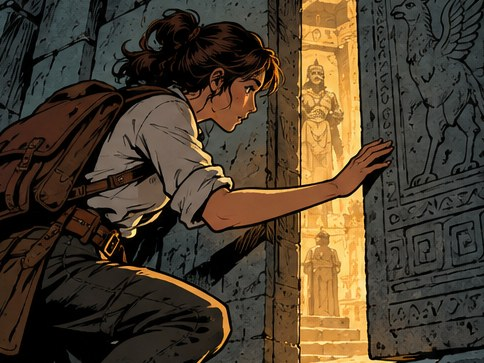

[← Mục lục](../../../README.md) · [Illustration & Art (Minh họa và nghệ thuật)](../README.md)

# `/comic-panel`

Tạo một khung truyện tranh với hành động rõ.



<sub>Kết quả mẫu</sub>

## Ví dụ lệnh

```text
/comic-panel — nhân vật mở cánh cửa bí mật
```

---

[← `/storyboard`](../../../commands/04-illustration-and-art/storyboard/README.md) · [`/children-book` →](../../../commands/04-illustration-and-art/children-book/README.md)
