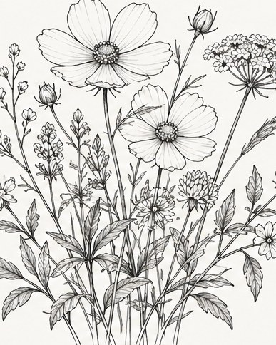

[← Mục lục](../../../README.md) · [Minh họa và nghệ thuật](../README.md)

# `/line-art`

Tạo hình bằng nét viền sạch, ít hoặc không tô màu.



<sub>Kết quả mẫu</sub>

## Ví dụ lệnh

```text
/line-art — bó hoa dại, nét mảnh
```

---

[← `/sketch`](../../../commands/04-illustration-and-art/sketch/README.md) · [`/pixel-art` →](../../../commands/04-illustration-and-art/pixel-art/README.md)
