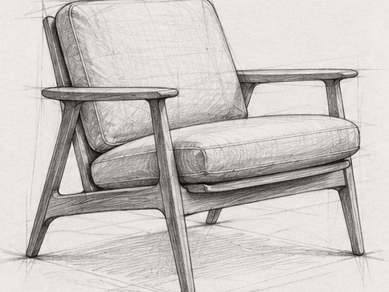

[← Mục lục](../../../README.md) · [Illustration & Art (Minh họa và nghệ thuật)](../README.md)

# `/sketch`

Tạo phác thảo nhanh bằng chì hoặc mực.



<sub>Kết quả mẫu</sub>

## Ví dụ lệnh

```text
/sketch — ghế lounge, góc ba phần tư
```

---

[← `/oil-painting`](../../../commands/04-illustration-and-art/oil-painting/README.md) · [`/line-art` →](../../../commands/04-illustration-and-art/line-art/README.md)
