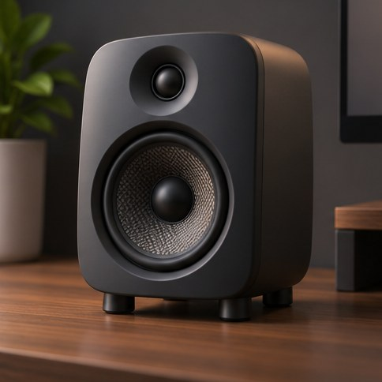

[← Mục lục](../../../README.md) · [Minh họa và nghệ thuật](../README.md)

# `/3d-render`

Tạo hình kết xuất 3D với vật liệu và ánh sáng rõ.



<sub>Kết quả mẫu</sub>

## Ví dụ lệnh

```text
/3d-render — loa để bàn bằng nhựa mờ
```

---

[← `/pixel-art`](../../../commands/04-minh-hoa-va-nghe-thuat/pixel-art/README.md) · [`/isometric` →](../../../commands/04-minh-hoa-va-nghe-thuat/isometric/README.md)
