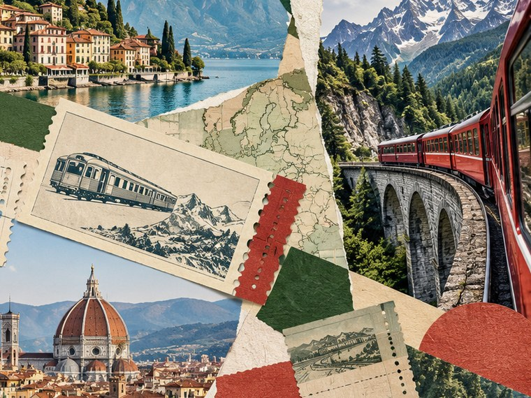

[← Mục lục](../../../README.md) · [Minh họa và nghệ thuật](../README.md)

# `/collage`

Kết hợp ảnh, giấy và texture theo bố cục cắt dán.



<sub>Kết quả mẫu</sub>

## Ví dụ lệnh

```text
/collage — du lịch đường sắt châu Âu
```

---

[← `/isometric`](../../../commands/04-minh-hoa-va-nghe-thuat/isometric/README.md) · [`/pattern` →](../../../commands/04-minh-hoa-va-nghe-thuat/pattern/README.md)
