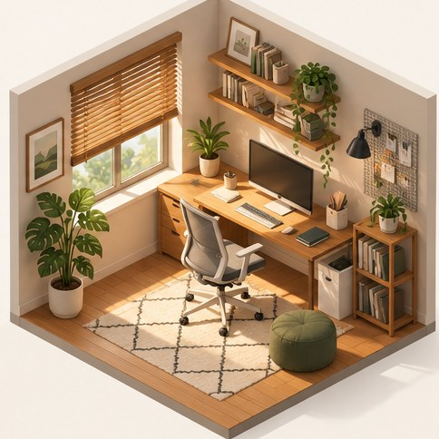

[← Mục lục](../../../README.md) · [Minh họa và nghệ thuật](../README.md)

# `/isometric`

Tạo góc nhìn đẳng cự phù hợp bản đồ hoặc mô hình.



<sub>Kết quả mẫu</sub>

## Ví dụ lệnh

```text
/isometric — phòng làm việc nhỏ
```

---

[← `/3d-render`](../../../commands/04-minh-hoa-va-nghe-thuat/3d-render/README.md) · [`/collage` →](../../../commands/04-minh-hoa-va-nghe-thuat/collage/README.md)
