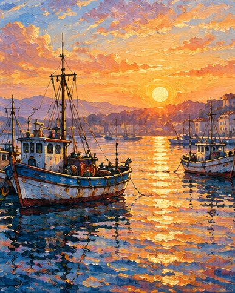

[← Mục lục](../../../README.md) · [Minh họa và nghệ thuật](../README.md)

# `/oil-painting`

Mô phỏng lớp sơn dày, ánh sáng và chiều sâu hội họa.



<sub>Kết quả mẫu</sub>

## Ví dụ lệnh

```text
/oil-painting — thuyền đánh cá lúc bình minh
```

---

[← `/watercolor`](../../../commands/04-minh-hoa-va-nghe-thuat/watercolor/README.md) · [`/sketch` →](../../../commands/04-minh-hoa-va-nghe-thuat/sketch/README.md)
