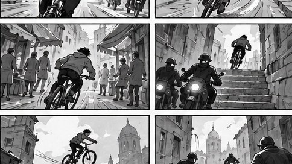

[← Mục lục](../../../README.md) · [Minh họa và nghệ thuật](../README.md)

# `/storyboard`

Tạo chuỗi khung hình mô tả hành động và góc máy.



<sub>Kết quả mẫu</sub>

## Ví dụ lệnh

```text
/storyboard — cảnh rượt đuổi 6 khung
```

---

[← `/concept-art`](../../../commands/04-minh-hoa-va-nghe-thuat/concept-art/README.md) · [`/comic-panel` →](../../../commands/04-minh-hoa-va-nghe-thuat/comic-panel/README.md)
