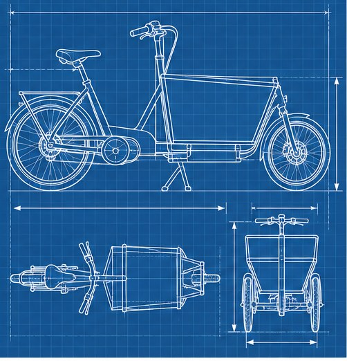

[← Mục lục](../../../README.md) · [Sơ đồ và ý tưởng](../README.md)

# `/blueprint`

Tạo bản vẽ ý tưởng theo phong cách kỹ thuật.



<sub>Kết quả mẫu</sub>

## Ví dụ lệnh

```text
/blueprint — xe đạp chở hàng điện
```

---

[← `/timeline`](../../../commands/05-diagrams-and-ideas/timeline/README.md) · [`/cutaway` →](../../../commands/05-diagrams-and-ideas/cutaway/README.md)
