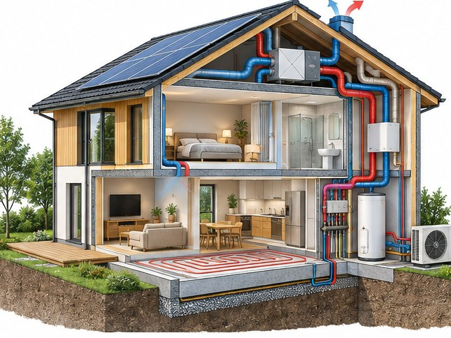

[← Mục lục](../../../README.md) · [Diagrams & Ideas (Sơ đồ và ý tưởng)](../README.md)

# `/cutaway`

Cắt một phần vỏ để nhìn cấu trúc bên trong.



<sub>Kết quả mẫu</sub>

## Ví dụ lệnh

```text
/cutaway — nhà tiết kiệm năng lượng
```

---

[← `/blueprint`](../../../commands/05-diagrams-and-ideas/blueprint/README.md) · [`/exploded-view` →](../../../commands/05-diagrams-and-ideas/exploded-view/README.md)
