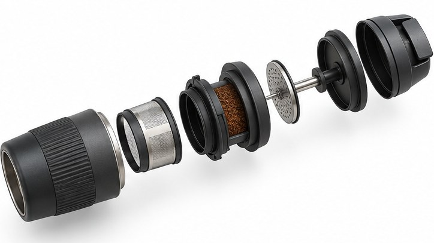

[← Mục lục](../../../README.md) · [Sơ đồ và ý tưởng](../README.md)

# `/exploded-view`

Tách các bộ phận theo trục để giải thích lắp ráp.



<sub>Kết quả mẫu</sub>

## Ví dụ lệnh

```text
/exploded-view — máy pha cà phê cầm tay
```

---

[← `/cutaway`](../../../commands/05-diagrams-and-ideas/cutaway/README.md) · [`/technical-drawing` →](../../../commands/05-diagrams-and-ideas/technical-drawing/README.md)
