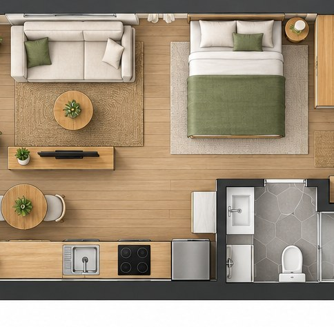

[← Mục lục](../../../README.md) · [Sơ đồ và ý tưởng](../README.md)

# `/floor-plan`

Tạo mặt bằng nhìn từ trên xuống cho không gian.



<sub>Kết quả mẫu</sub>

## Ví dụ lệnh

```text
/floor-plan — căn hộ studio 35 mét vuông
```

---

[← `/technical-drawing`](../../../commands/05-diagrams-and-ideas/technical-drawing/README.md) · [`/edit` →](../../../commands/06-photo-editing/edit/README.md)
