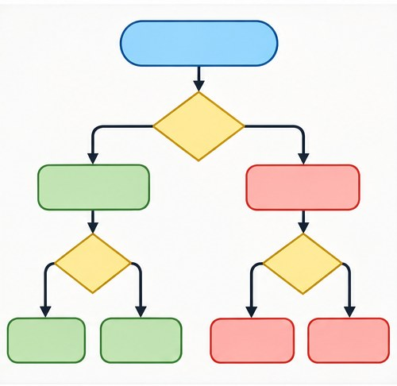

[← Mục lục](../../../README.md) · [Diagrams & Ideas (Sơ đồ và ý tưởng)](../README.md)

# `/flowchart`

Tạo luồng quyết định hoặc quy trình theo bước.



<sub>Kết quả mẫu</sub>

## Ví dụ lệnh

```text
/flowchart — xử lý yêu cầu hỗ trợ khách hàng
```

---

[← `/diagram`](../../../commands/05-diagrams-and-ideas/diagram/README.md) · [`/map` →](../../../commands/05-diagrams-and-ideas/map/README.md)
