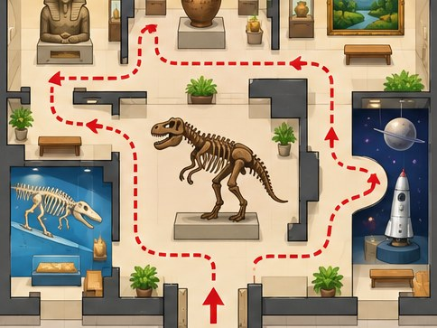

[← Mục lục](../../../README.md) · [Sơ đồ và ý tưởng](../README.md)

# `/map`

Tạo bản đồ minh họa địa điểm, tuyến đường hoặc thế giới hư cấu.



<sub>Kết quả mẫu</sub>

## Ví dụ lệnh

```text
/map — tuyến tham quan bảo tàng
```

---

[← `/flowchart`](../../../commands/05-diagrams-and-ideas/flowchart/README.md) · [`/mind-map` →](../../../commands/05-diagrams-and-ideas/mind-map/README.md)
