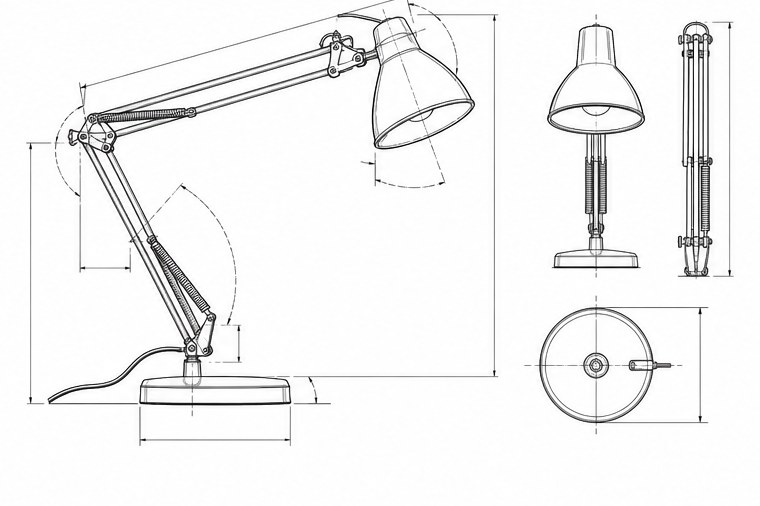

[← Mục lục](../../../README.md) · [Diagrams & Ideas (Sơ đồ và ý tưởng)](../README.md)

# `/technical-drawing`

Tạo hình kỹ thuật nhấn vào tỷ lệ và cấu tạo.



<sub>Kết quả mẫu</sub>

## Ví dụ lệnh

```text
/technical-drawing — đèn bàn khớp xoay
```

---

[← `/exploded-view`](../../../commands/05-diagrams-and-ideas/exploded-view/README.md) · [`/floor-plan` →](../../../commands/05-diagrams-and-ideas/floor-plan/README.md)
