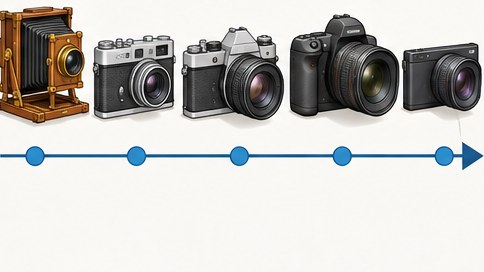

[← Mục lục](../../../README.md) · [Sơ đồ và ý tưởng](../README.md)

# `/timeline`

Trình bày sự kiện hoặc giai đoạn theo thời gian.



<sub>Kết quả mẫu</sub>

## Ví dụ lệnh

```text
/timeline — lịch sử máy ảnh 1900 đến nay
```

---

[← `/mind-map`](../../../commands/05-diagrams-and-ideas/mind-map/README.md) · [`/blueprint` →](../../../commands/05-diagrams-and-ideas/blueprint/README.md)
