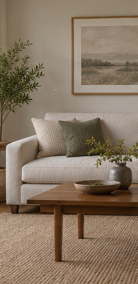

[← Mục lục](../../../README.md) · [Chỉnh sửa ảnh](../README.md)

# `/relight`

Thay đổi hướng, độ mềm hoặc thời điểm ánh sáng.

| Before | After |
|:---:|:---:|
|  |  |

## Ví dụ lệnh

```text
/relight — ánh sáng hoàng hôn từ bên trái
```

---

[← `/recolor`](../../../commands/06-chinh-sua-anh/recolor/README.md) · [`/upscale` →](../../../commands/06-chinh-sua-anh/upscale/README.md)
