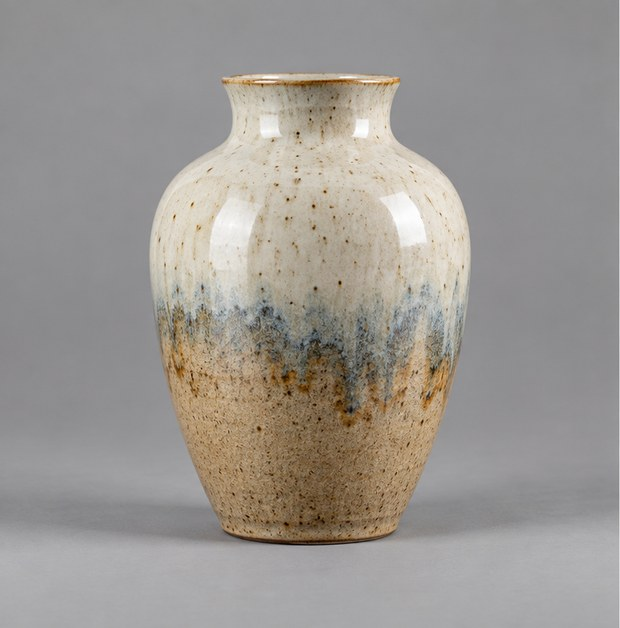
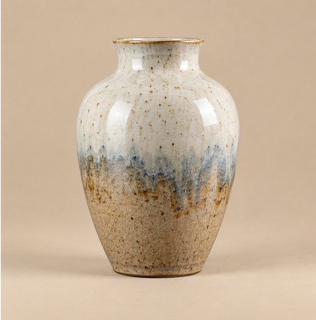

[← Mục lục](../../../README.md) · [Chỉnh sửa ảnh](../README.md)

# `/replace-background`

Đổi bối cảnh nhưng giữ nguyên chủ thể.

| Before | After |
|:---:|:---:|
|  |  |

## Ví dụ lệnh

```text
/replace-background — chuyển sang studio màu be
```

---

[← `/replace-object`](../../../commands/06-chinh-sua-anh/replace-object/README.md) · [`/remove-background` →](../../../commands/06-chinh-sua-anh/remove-background/README.md)
