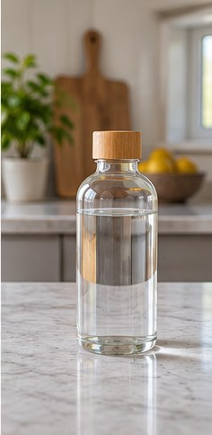

[← Mục lục](../../../README.md) · [Chỉnh sửa ảnh](../README.md)

# `/replace-object`

Thay một vật thể bằng vật thể khác cùng vị trí.

| Before | After |
|:---:|:---:|
|  |  |

## Ví dụ lệnh

```text
/replace-object — thay cốc bằng bình thủy tinh
```

---

[← `/remove-object`](../../../commands/06-chinh-sua-anh/remove-object/README.md) · [`/replace-background` →](../../../commands/06-chinh-sua-anh/replace-background/README.md)
