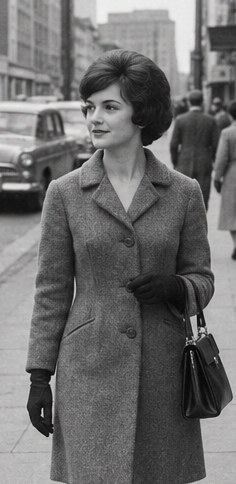
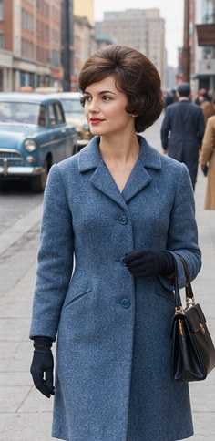

[← Mục lục](../../../README.md) · [Photo Editing (Chỉnh sửa ảnh)](../README.md)

# `/colorize`

Thêm màu cho ảnh đen trắng.

| Before | After |
|:---:|:---:|
|  |  |

## Ví dụ lệnh

```text
/colorize — màu tự nhiên theo thập niên 1960
```

---

[← `/restore`](../../../commands/06-photo-editing/restore/README.md) · [`/recolor` →](../../../commands/06-photo-editing/recolor/README.md)
