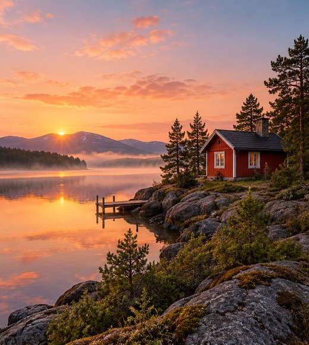
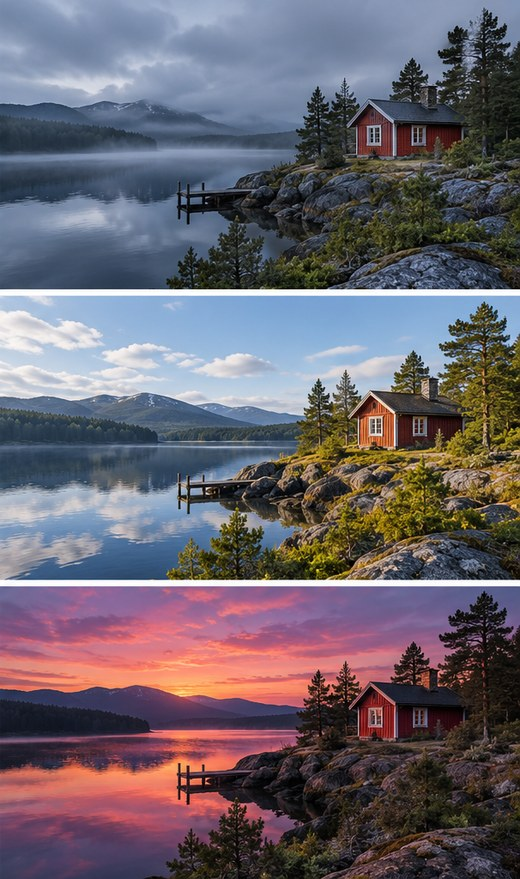

[← Mục lục](../../../README.md) · [Chỉnh sửa ảnh](../README.md)

# `/image-variation`

Tạo biến thể giữ ý tưởng chính nhưng đổi chi tiết.

| Before | After |
|:---:|:---:|
|  |  |

## Ví dụ lệnh

```text
/image-variation — ba phiên bản màu và ánh sáng
```

---

[← `/style-transfer`](../../../commands/06-photo-editing/style-transfer/README.md)
