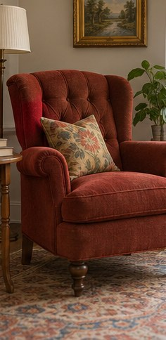
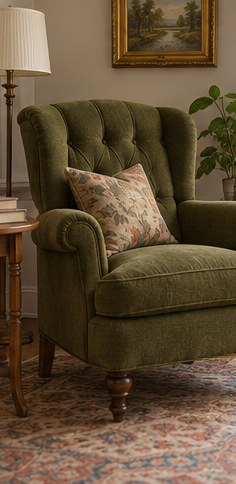

[← Mục lục](../../../README.md) · [Chỉnh sửa ảnh](../README.md)

# `/recolor`

Đổi màu một vật thể hoặc bảng màu của ảnh.

| Before | After |
|:---:|:---:|
|  |  |

## Ví dụ lệnh

```text
/recolor — đổi ghế đỏ thành xanh olive
```

---

[← `/colorize`](../../../commands/06-photo-editing/colorize/README.md) · [`/relight` →](../../../commands/06-photo-editing/relight/README.md)
